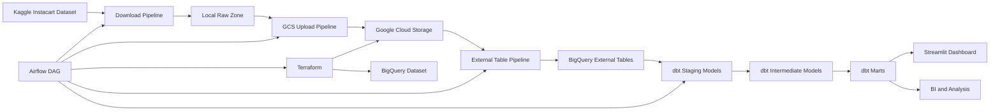
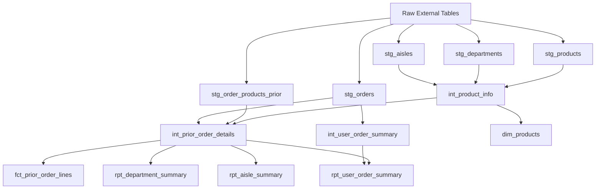

# Instacart Online Grocery Basket Analysis

An end-to-end data engineering project that ingests the Instacart Online Grocery Basket Analysis dataset, provisions cloud infrastructure, orchestrates the pipeline with Airflow, transforms raw data with dbt on BigQuery, and serves the final reporting tables through an interactive Streamlit dashboard.

## Problem Statement

Online grocery teams need a reliable way to understand which departments and aisles drive demand, how often customers reorder, and how shopper behavior varies across product categories. The source dataset arrives as separate raw CSV files, which are not immediately suitable for analysis or dashboarding.

This project turns those raw files into tested, analytics-ready BigQuery marts and a dashboard that supports fast exploration of category performance and customer ordering behavior.

## What This Project Delivers

- Automated ingestion of the Instacart dataset from Kaggle
- Cloud infrastructure provisioning with Terraform
- Raw file storage in Google Cloud Storage
- BigQuery external tables over the raw CSV layer
- dbt staging, intermediate, fact, dimension, and reporting models
- Airflow orchestration for the full ELT workflow
- Data quality checks with dbt tests
- Streamlit dashboard over the final `rpt_*` tables
- Reproducible local runtime with Docker Compose and `uv`

## Architecture



The pipeline follows an ELT pattern:

- **Extract:** Download source files from Kaggle.
- **Load:** Store raw files in GCS and expose them through BigQuery external tables.
- **Transform:** Build cleaned, enriched, and reporting-ready models with dbt.
- **Orchestrate:** Use Airflow to run the workflow in sequence.
- **Visualize:** Query the final marts from Streamlit for interactive analysis.

## Repository Structure

```text
.
├── analytics/                 # dbt project
│   ├── dbt_project.yml
│   ├── profiles.yml
│   ├── models/
│   │   ├── staging/
│   │   ├── intermediate/
│   │   └── marts/
│   └── tests/
├── dags/                      # Airflow DAGs
├── dashboard/                 # Streamlit dashboard
├── iac/                       # Terraform configuration
├── pipelines/                 # Python ingestion and BigQuery setup scripts
├── Dockerfile.airflow         # Custom Airflow image
├── docker-compose.yaml        # Local Airflow stack
├── pyproject.toml             # Python dependencies
└── uv.lock                    # Locked dependency graph
```

## Core Components

| Component | Purpose |
| --- | --- |
| [`dags/instacart_dag.py`](dags/instacart_dag.py) | Orchestrates download, infrastructure provisioning, upload, external table creation, and dbt execution. |
| [`pipelines/download_datasets.py`](pipelines/download_datasets.py) | Downloads the Instacart dataset from Kaggle. |
| [`pipelines/upload_data_to_gcs.py`](pipelines/upload_data_to_gcs.py) | Uploads local raw files to Google Cloud Storage. |
| [`pipelines/create_external_tables.py`](pipelines/create_external_tables.py) | Creates BigQuery external tables over GCS CSV files. |
| [`iac/main.tf`](iac/main.tf) | Provisions the GCS bucket and BigQuery dataset. |
| [`analytics/models`](analytics/models) | Contains dbt transformations and reporting marts. |
| [`dashboard/app.py`](dashboard/app.py) | Streamlit dashboard querying the final BigQuery reporting tables. |
| [`Dockerfile.airflow`](Dockerfile.airflow) | Builds the Airflow image with Terraform, dbt, and project dependencies. |

## Data Model



The dbt project is organized into three layers:

- **Staging:** Cleans and standardizes raw external tables.
- **Intermediate:** Applies reusable joins and business logic.
- **Marts:** Produces fact, dimension, and reporting tables for analytics.

## Analytics Outputs

| Model | Description |
| --- | --- |
| `dim_products` | Product dimension enriched with aisle and department labels. |
| `fct_prior_order_lines` | Prior-order product line fact table. |
| `rpt_department_summary` | Department-level demand and reorder summary. |
| `rpt_aisle_summary` | Aisle-level performance and product mix summary. |
| `rpt_user_order_summary` | User-level ordering and reorder behavior summary. |

## Interactive Dashboard

The Streamlit dashboard reads the final dbt reporting tables directly from BigQuery.

Dashboard features:

- Executive KPI cards
- Department performance rankings
- Aisle drilldown with department filters
- Configurable top-N analysis
- Metric selector for ranking views
- User behavior segmentation by order frequency
- Cached BigQuery reads for responsive local exploration

Run the dashboard after the dbt marts exist:

```bash
set -a
source .env
set +a
uv run streamlit run dashboard/app.py
```

Open [http://localhost:8501](http://localhost:8501).

## Prerequisites

Install or configure the following before running the project:

- Python 3.11+
- [`uv`](https://github.com/astral-sh/uv)
- Docker and Docker Compose
- Terraform
- Google Cloud project
- Google Cloud service account with GCS and BigQuery permissions
- Kaggle API credentials

## Configuration

### Local Environment

Create `.env` from the template:

```bash
cp .env.example .env
```

Set the required values:

```env
GCP_PROJECT_ID=your-gcp-project-id
DBT_DATASET_NAME=instacart_warehouse_dev
GOOGLE_APPLICATION_CREDENTIALS=/absolute/path/to/credentials/service-account.json
BUCKET_NAME=your-unique-gcs-bucket-name
```

### Airflow Environment

Create `.env.airflow` from the template:

```bash
cp .env.airflow.example .env.airflow
```

Set container-friendly values:

```env
AIRFLOW_UID=50000
DATA_DIR=/opt/airflow/data
GCP_PROJECT_ID=your-gcp-project-id
DBT_DATASET_NAME=instacart_warehouse_dev
GOOGLE_APPLICATION_CREDENTIALS=/opt/airflow/credentials/service-account.json
IAC_DIR=/opt/airflow/iac
BUCKET_NAME=your-unique-gcs-bucket-name
KAGGLE_USERNAME=your-kaggle-username
KAGGLE_KEY=your-kaggle-api-key
```

Place the service account JSON in `credentials/` so it is mounted into the Airflow containers.

### Terraform Variables

Create the Terraform variable file:

```bash
cp iac/terraform.tfvars.example iac/terraform.tfvars
```

Update at least:

- `project_id`
- `region`
- `bucket_name`
- `bigquery_dataset_id`
- `bigquery_location`

## Reproduce the Project

### 1. Install Dependencies

```bash
uv sync
```

### 2. Prepare dbt Sources

Create the source definition used by dbt:

```bash
cp analytics/models/src_instacart_raw_template.yml analytics/models/src_instacart_raw.yml
```

The template is environment-variable driven, so it will resolve the configured project and dataset at runtime.

### 3. Start Airflow

```bash
docker compose up --build -d
```

Airflow will be available at [http://localhost:8080](http://localhost:8080).

### 4. Trigger the Pipeline

In the Airflow UI:

1. Open the `instacart_download_datasets` DAG.
2. Enable the DAG.
3. Trigger a run.

The DAG runs:

1. Dataset download from Kaggle
2. Terraform initialization and apply
3. Upload of raw files to GCS
4. BigQuery external table creation
5. dbt model execution on BigQuery

### 5. Validate the Warehouse

Confirm that the BigQuery dataset contains:

- Raw external tables
- `dim_products`
- `fct_prior_order_lines`
- `rpt_department_summary`
- `rpt_aisle_summary`
- `rpt_user_order_summary`

You can also validate dbt manually:

```bash
uv run dbt debug --project-dir analytics --profiles-dir analytics
uv run dbt build --project-dir analytics --profiles-dir analytics
```

### 6. Launch the Dashboard

```bash
set -a
source .env
set +a
uv run streamlit run dashboard/app.py
```

Open [http://localhost:8501](http://localhost:8501).

## Manual Commands

Useful commands for local development:

```bash
# Start or rebuild the Airflow stack
docker compose up --build -d

# Stop the Airflow stack
docker compose down

# Run dbt from the project root
uv run dbt build --project-dir analytics --profiles-dir analytics

# Run only dbt models
uv run dbt run --project-dir analytics --profiles-dir analytics

# Run the dashboard
set -a
source .env
set +a
uv run streamlit run dashboard/app.py
```

## Quality Checks

The project includes dbt schema tests for key identifiers and accepted values, plus a custom duplicate-line guard:

- [`analytics/models/staging/_staging_models.yml`](analytics/models/staging/_staging_models.yml)
- [`analytics/models/intermediate/_intermediate_models.yml`](analytics/models/intermediate/_intermediate_models.yml)
- [`analytics/models/marts/_marts_models.yml`](analytics/models/marts/_marts_models.yml)
- [`analytics/tests/no_duplicate_prior_order_lines.sql`](analytics/tests/no_duplicate_prior_order_lines.sql)

Run all dbt tests with:

```bash
uv run dbt test --project-dir analytics --profiles-dir analytics
```

## Operational Notes

- Airflow uses the custom image in [`Dockerfile.airflow`](Dockerfile.airflow).
- The Docker image verifies `dbt` at build time with `dbt --version`.
- dbt and Streamlit both read BigQuery configuration from environment variables.
- `credentials/`, `.env`, `.env.airflow`, and Terraform state files should not be committed.
- The Streamlit app caches BigQuery table reads for 15 minutes.

## Tech Stack

- **Orchestration:** Apache Airflow
- **Infrastructure as Code:** Terraform
- **Cloud Storage:** Google Cloud Storage
- **Warehouse:** BigQuery
- **Transformations:** dbt
- **Dashboard:** Streamlit
- **Runtime and Packaging:** Docker Compose, `uv`, Python
