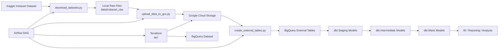
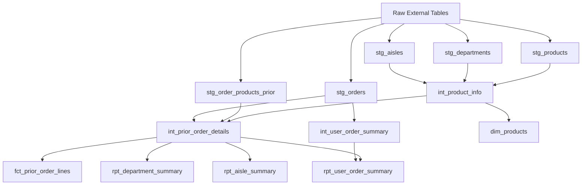

# Instacart Online Grocery Basket Analysis

This project is an end-to-end data engineering workflow built around the Instacart Online Grocery Basket Analysis dataset. It combines infrastructure provisioning, orchestration, cloud storage, external tables in BigQuery, and dbt transformations to turn raw CSV files into analytics-ready models.

## Contents

- [Core Features](#core-features)
- [Key Components](#key-components)
- [Architecture](#architecture)
- [Transformation Model](#transformation-model)
- [Project Flow](#project-flow)
- [Main Outputs](#main-outputs)
- [Looker Studio](#looker-studio)
- [Key Metrics](#key-metrics)
- [Component Responsibilities](#component-responsibilities)
- [Prerequisites](#prerequisites)
- [Reproduction Steps](#reproduction-steps)
- [dbt Model Structure](#dbt-model-structure)
- [Notes](#notes)

## Core Features

- Automated dataset ingestion from Kaggle using `kagglehub`
- Infrastructure provisioning with Terraform for Google Cloud Storage and BigQuery
- Airflow DAG orchestration for download, upload, and external table creation
- Raw data landing in GCS and queryable via BigQuery external tables
- Layered dbt transformations across staging, intermediate, and marts models
- Data quality coverage with dbt tests and a custom duplicate-check test
- Reporting-friendly outputs for products, departments, aisles, and user order behavior

## Key Components

- [`dags/instacart_dag.py`](/Users/artemijskurtenoks/Desktop/Coding/Projects/Instacart-Online-Grocery-Basket-Analysis---Data-Engineering-Project/dags/instacart_dag.py): Airflow orchestration entrypoint that sequences ingestion, infrastructure, upload, and external table creation
- [`pipelines/download_datasets.py`](/Users/artemijskurtenoks/Desktop/Coding/Projects/Instacart-Online-Grocery-Basket-Analysis---Data-Engineering-Project/pipelines/download_datasets.py): downloads the Kaggle Instacart dataset into the local raw landing zone
- [`pipelines/upload_data_to_gcs.py`](/Users/artemijskurtenoks/Desktop/Coding/Projects/Instacart-Online-Grocery-Basket-Analysis---Data-Engineering-Project/pipelines/upload_data_to_gcs.py): copies downloaded raw files from local storage into GCS
- [`pipelines/create_external_tables.py`](/Users/artemijskurtenoks/Desktop/Coding/Projects/Instacart-Online-Grocery-Basket-Analysis---Data-Engineering-Project/pipelines/create_external_tables.py): registers raw CSV files in BigQuery as external tables
- [`iac/main.tf`](/Users/artemijskurtenoks/Desktop/Coding/Projects/Instacart-Online-Grocery-Basket-Analysis---Data-Engineering-Project/iac/main.tf): provisions the storage bucket and BigQuery dataset needed by the pipeline
- [`docker-compose.yaml`](/Users/artemijskurtenoks/Desktop/Coding/Projects/Instacart-Online-Grocery-Basket-Analysis---Data-Engineering-Project/docker-compose.yaml): defines the local Airflow runtime with scheduler, workers, Postgres, and Redis
- [`Dockerfile.airflow`](/Users/artemijskurtenoks/Desktop/Coding/Projects/Instacart-Online-Grocery-Basket-Analysis---Data-Engineering-Project/Dockerfile.airflow): custom Airflow image with Terraform and project dependencies installed
- [`analytics/profiles.yml`](/Users/artemijskurtenoks/Desktop/Coding/Projects/Instacart-Online-Grocery-Basket-Analysis---Data-Engineering-Project/analytics/profiles.yml): dbt BigQuery connection profile driven by environment variables
- [`analytics/models/staging/`](/Users/artemijskurtenoks/Desktop/Coding/Projects/Instacart-Online-Grocery-Basket-Analysis---Data-Engineering-Project/analytics/models/staging): source cleanup and type-standardization layer
- [`analytics/models/intermediate/`](/Users/artemijskurtenoks/Desktop/Coding/Projects/Instacart-Online-Grocery-Basket-Analysis---Data-Engineering-Project/analytics/models/intermediate): reusable business logic and enriched joins
- [`analytics/models/marts/`](/Users/artemijskurtenoks/Desktop/Coding/Projects/Instacart-Online-Grocery-Basket-Analysis---Data-Engineering-Project/analytics/models/marts): reporting-ready facts, dimensions, and summary tables

## Architecture

The architecture follows a straightforward ELT pattern:

- Extract: Kaggle data is downloaded into a local raw zone
- Load: raw files are uploaded to GCS and exposed in BigQuery as external tables
- Transform: dbt builds staging, intermediate, and marts models inside BigQuery
- Orchestrate: Airflow coordinates the end-to-end workflow
- Provision: Terraform manages the bucket and warehouse dataset as code



## Transformation Model

The dbt layer is organized so that each step adds a small, well-scoped transformation:

- Staging models standardize the raw external tables
- Intermediate models enrich products and prior-order lines with descriptive attributes
- Mart models expose final entities and summaries for analytics use cases



## Project Flow

1. Airflow runs [`dags/instacart_dag.py`](/Users/artemijskurtenoks/Desktop/Coding/Projects/Instacart-Online-Grocery-Basket-Analysis---Data-Engineering-Project/dags/instacart_dag.py).
2. [`pipelines/download_datasets.py`](/Users/artemijskurtenoks/Desktop/Coding/Projects/Instacart-Online-Grocery-Basket-Analysis---Data-Engineering-Project/pipelines/download_datasets.py) downloads the Instacart dataset into `data/instacart_raw/`.
3. Terraform provisions the GCS bucket and BigQuery dataset from [`iac/`](/Users/artemijskurtenoks/Desktop/Coding/Projects/Instacart-Online-Grocery-Basket-Analysis---Data-Engineering-Project/iac).
4. [`pipelines/upload_data_to_gcs.py`](/Users/artemijskurtenoks/Desktop/Coding/Projects/Instacart-Online-Grocery-Basket-Analysis---Data-Engineering-Project/pipelines/upload_data_to_gcs.py) uploads local files into GCS.
5. [`pipelines/create_external_tables.py`](/Users/artemijskurtenoks/Desktop/Coding/Projects/Instacart-Online-Grocery-Basket-Analysis---Data-Engineering-Project/pipelines/create_external_tables.py) creates external BigQuery tables over the CSV files in the bucket.
6. dbt models in [`analytics/models/`](/Users/artemijskurtenoks/Desktop/Coding/Projects/Instacart-Online-Grocery-Basket-Analysis---Data-Engineering-Project/analytics/models) transform the raw tables into reusable marts.

## Main Outputs

The dbt project currently produces these main analytics models:

- `dim_products`: product dimension enriched with aisle and department labels
- `fct_prior_order_lines`: fact table of prior order line items
- `rpt_department_summary`: department-level metrics such as orders, users, products, and reorder rate
- `rpt_aisle_summary`: aisle-level performance summary
- `rpt_user_order_summary`: user-level ordering and reorder behavior summary

## Looker Studio

The marts layer is designed to serve as the semantic reporting layer for Looker Studio. BigQuery can be connected directly to Looker Studio, with the final dbt marts acting as the main reporting tables.

Suggested Looker Studio sources:

- `rpt_department_summary` for department-level scorecards and ranking tables
- `rpt_aisle_summary` for aisle-level drill-down analysis
- `rpt_user_order_summary` for customer behavior and reorder patterns
- `dim_products` for product attribute lookups and filtering dimensions
- `fct_prior_order_lines` for detailed exploratory analysis and custom charts

Typical dashboard pages:

- Executive overview with high-level KPIs
- Department performance with reorder behavior by department
- Aisle analysis with product mix and cart-position patterns
- User behavior with repeat-purchase and ordering-frequency metrics

## Key Metrics

The current marts support these core metrics out of the box:

- `line_items`: total prior-order line items
- `orders`: distinct orders
- `users`: distinct users
- `products`: distinct products
- `reorder_rate`: average of the `reordered` flag, used as a repeat-purchase indicator
- `avg_add_to_cart_position`: average placement of a product in the cart sequence
- `total_orders`: total number of orders per user
- `prior_orders_with_products`: number of prior orders with at least one line item
- `prior_line_items`: total prior-order lines per user
- `unique_products_ordered`: number of distinct products ordered by a user
- `avg_days_since_prior_order`: average gap between user orders

These metrics make it easy to answer questions such as:

- Which departments and aisles drive the most order volume?
- Which categories have the highest reorder rate?
- How broad is the product assortment used by each customer?
- How often do customers return and place another order?
- Which products or categories tend to be added earlier in the cart flow?

## Component Responsibilities

- Airflow is responsible for operational sequencing and repeatable execution
- Terraform is responsible for provisioning cloud infrastructure consistently across environments
- GCS acts as the raw object storage layer for downloaded CSV files
- BigQuery external tables provide a queryable raw layer without first loading files into native tables
- dbt handles transformation logic, testing, and final analytics table generation
- Docker Compose provides a reproducible local runtime for Airflow and its dependencies

## Prerequisites

Before reproducing the project, make sure you have:

- Python 3.11+
- [`uv`](https://github.com/astral-sh/uv)
- Docker and Docker Compose
- Terraform
- A GCP project
- A GCP service account with access to GCS and BigQuery
- Kaggle API credentials

## Reproduction Steps

### 1. Clone the repository

```bash
git clone https://github.com/<your-org-or-username>/Instacart-Online-Grocery-Basket-Analysis---Data-Engineering-Project.git
cd Instacart-Online-Grocery-Basket-Analysis---Data-Engineering-Project
```

### 2. Install Python dependencies

```bash
uv sync
```

This installs the project dependencies from [`pyproject.toml`](/Users/artemijskurtenoks/Desktop/Coding/Projects/Instacart-Online-Grocery-Basket-Analysis---Data-Engineering-Project/pyproject.toml).

### 3. Add GCP credentials

Place your service account JSON file in [`credentials/`](/Users/artemijskurtenoks/Desktop/Coding/Projects/Instacart-Online-Grocery-Basket-Analysis---Data-Engineering-Project/credentials) or another accessible location.

Example:

```text
credentials/service-account.json
```

### 4. Configure local environment variables

Copy the local environment template:

```bash
cp .env.example .env
```

Update `.env` with your values:

```env
GCP_PROJECT_ID=your-gcp-project-id
DBT_DATASET_NAME=instacart_warehouse_dev
GOOGLE_APPLICATION_CREDENTIALS=/absolute/path/to/credentials/service-account.json
BUCKET_NAME=your-unique-gcs-bucket-name
```

If you use `direnv`, the repo already includes `.envrc`:

```bash
direnv allow
```

### 5. Configure Terraform

Copy the example Terraform variables file:

```bash
cp iac/terraform.tfvars.example iac/terraform.tfvars
```

Then update the values in `iac/terraform.tfvars`, especially:

- `project_id`
- `region`
- `bucket_name`
- `bigquery_dataset_id`
- `bigquery_location`

### 6. Provision cloud resources

```bash
terraform -chdir=iac init
terraform -chdir=iac plan
terraform -chdir=iac apply
```

This provisions:

- a GCS bucket for raw Instacart files
- a BigQuery dataset for analytics and external tables

### 7. Configure Airflow container environment

Copy the Airflow environment template:

```bash
cp .env.airflow.example .env.airflow
```

Update `.env.airflow` with values for the containerized environment. At minimum, make sure these are set correctly:

```env
AIRFLOW_UID=50000
DATA_DIR=/opt/airflow/data
GCP_PROJECT_ID=your-gcp-project-id
DBT_DATASET_NAME=instacart_warehouse_dev
GOOGLE_APPLICATION_CREDENTIALS=/opt/airflow/credentials/service-account.json
IAC_DIR=/opt/airflow/iac
BUCKET_NAME=your-unique-gcs-bucket-name
KAGGLE_USERNAME=your-kaggle-username
KAGGLE_KEY=your-kaggle-api-key
```

`KAGGLE_USERNAME` and `KAGGLE_KEY` are required for the dataset download step.

### 8. Start Airflow

```bash
docker compose up --build -d
```

The Airflow UI will be available at [http://localhost:8080](http://localhost:8080).

### 9. Run the pipeline

In Airflow:

1. Open the DAG `instacart_download_datasets`.
2. Enable the DAG.
3. Trigger a run.

The DAG executes four steps in order:

1. Download the dataset from Kaggle
2. Create or apply GCS and BigQuery infrastructure with Terraform
3. Upload files from `data/` into GCS
4. Create BigQuery external tables

### 10. Verify the raw layer

After the DAG succeeds, confirm:

- CSV files exist in [`data/instacart_raw/`](/Users/artemijskurtenoks/Desktop/Coding/Projects/Instacart-Online-Grocery-Basket-Analysis---Data-Engineering-Project/data/instacart_raw)
- files were uploaded to your GCS bucket
- external tables exist in your BigQuery dataset

### 11. Create the dbt source definition

Copy the provided source template:

```bash
cp analytics/models/src_instacart_raw_template.yml analytics/models/src_instacart_raw.yml
```

Update the new file so the source schema matches the BigQuery dataset that contains your raw external tables.

### 12. Run dbt models and tests

```bash
cd analytics
dbt debug --profiles-dir .
dbt build --profiles-dir .
```

This will build:

- staging models for aisles, departments, products, orders, and prior order lines
- intermediate models for enriched order and product entities
- marts models for reporting and analysis

## dbt Model Structure

- [`analytics/models/staging/`](/Users/artemijskurtenoks/Desktop/Coding/Projects/Instacart-Online-Grocery-Basket-Analysis---Data-Engineering-Project/analytics/models/staging): cleaned raw-source views
- [`analytics/models/intermediate/`](/Users/artemijskurtenoks/Desktop/Coding/Projects/Instacart-Online-Grocery-Basket-Analysis---Data-Engineering-Project/analytics/models/intermediate): reusable enriched joins and user summaries
- [`analytics/models/marts/`](/Users/artemijskurtenoks/Desktop/Coding/Projects/Instacart-Online-Grocery-Basket-Analysis---Data-Engineering-Project/analytics/models/marts): final tables for BI and reporting
- [`analytics/tests/no_duplicate_prior_order_lines.sql`](/Users/artemijskurtenoks/Desktop/Coding/Projects/Instacart-Online-Grocery-Basket-Analysis---Data-Engineering-Project/analytics/tests/no_duplicate_prior_order_lines.sql): custom uniqueness guard for prior order lines

## Notes

- Airflow uses the custom image defined in [`Dockerfile.airflow`](/Users/artemijskurtenoks/Desktop/Coding/Projects/Instacart-Online-Grocery-Basket-Analysis---Data-Engineering-Project/Dockerfile.airflow), which installs Terraform and project dependencies.
- dbt reads credentials and dataset settings from environment variables via [`analytics/profiles.yml`](/Users/artemijskurtenoks/Desktop/Coding/Projects/Instacart-Online-Grocery-Basket-Analysis---Data-Engineering-Project/analytics/profiles.yml).
- The project is set up for local development and reproducibility, not production deployment.
